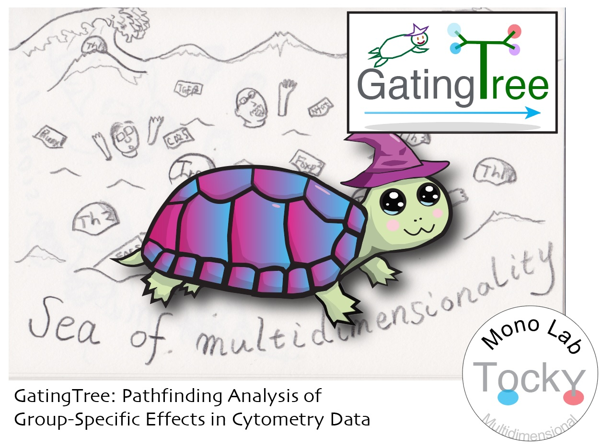

# GatingTree: R Package for Pathfinding Analysis of Group-Specific Effects in Cytometry Data 


## Table of Contents

1. [Introduction](#1-introduction)
2. [Installation](#2-installation)
3. [Vignettes](#3-vignettes)
4. [Package Manual](#4-package-manual)
5. [Citing GatingTree](#5-citing-gatingtree)
6. [License](#6-license)
7. [The Ono Lab (MonoTockyLab)](#7-the-ono-lab-monotockylab)
8. [Contact and More](#8-contact-and-more)


## 1. Introduction

Welcome to **GatingTree**, an R package developed to enhance the analysis of group-specific effects using cytometry data.

As cytometry technologies advance, they allow for the simultaneous analysis of an increasing number of markers. While this capability presents significant opportunities to fundamentally improve our understanding of biological systems, it also introduces substantial challenges in the data-oriented analysis of changes induced by biological effects, such as treatment effects.

Traditional methods like manual gating fall short of these demanding requirements. More recently, dimensional reduction methods (e.g., UMAP), with or without computational clustering, have become common. However, these methods frequently struggle with reproducibility across experiments, and the cell clusters they identify may not seamlessly translate into practical gating strategies for laboratory use.



The GatingTree approach departs from the traditional methods mentioned above by **not relying on dimensional reduction**. Instead, GatingTree explores the analysis of high-dimensional flow cytometry data in a previously unexplored way—investigating the landscape of marker multidimensional space using pathfinding analysis to uncover group-specific features. By avoiding any multidimensional or multivariate analysis or clustering algorithms, GatingTree offers straightforward solutions that can be directly used in downstream applications such as flow cytometric sorting of target populations.

## 2. Installation

To install **GatingTree**, first ensure that you have the `devtools` package installed:

```R
install.packages("devtools")
```

Then, install **GatingTree** from GitHub:

```R
library(devtools)
install_github("MonoTockyLab/GatingTree", dependencies = TRUE)
```

## 3. Vignettes

The **GatingTree** package includes vignettes to assist users in efficiently applying GatingTree to cytometry data.

- **[Basic Workflow](https://MonoTockyLab.github.io/GatingTree/articles/GatingTree_Workflow.html)**: This vignette provides users with a step-by-step guide to processing and transforming data, applying GatingTree analysis, and visualizing GatingTree.

- **[DefineNegatives](https://MonoTockyLab.github.io/GatingTree/articles/DefineNegatives.html)**: This vignette demonstrates how the function `DefineNegatives` can be used to determine positive/negative thresholds for markers, which is a critical preprocessing step for GatingTree analysis.

- **[Using CSV File Inputs](https://MonoTockyLab.github.io/GatingTree/articles/UsingCSVfileInputs.html)**: This vignette shows how to import cytometry sample data as CSV files and initialize a `FlowObject`.

*Note: You can access the vignettes within R using the `browseVignettes("GatingTree")` command after installing the package.*


## 4. Package Documentation

The **GatingTree** package documentation is available online:

- **Website**: [https://MonoTockyLab.github.io/GatingTree/](https://MonoTockyLab.github.io/GatingTree/)

This site includes all the function reference manuals and vignettes (tutorials).


In addition to the HTML manual pages, a PDF manual for the **GatingTree** package is available. You can find it in the installed package directory under `doc/`, or you can access it directly from [GitHub](https://github.com/MonoTockyLab/GatingTree/blob/master/inst/doc/GatingTree_0.1.0.pdf).

<br>

## 5. Citing GatingTree

If you use **GatingTree** in your research, please cite:

Masahiro Ono (2024). *GatingTree: Pathfinding Analysis of Group-Specific Effects in Cytometry Data*. arXiv preprint arXiv:YYYY.ZZZZZ [q-bio.QM]. Available at: [https://arxiv.org/abs/YYYY.ZZZZZ](https://arxiv.org/abs/YYYY.ZZZZZ).

### BibTeX Entry

```bibtex
@Article{Ono2024GatingTree,
  title   = {GatingTree: Pathfinding Analysis of Group-Specific Effects in Cytometry Data},
  author  = {Masahiro Ono},
  year    = {2024},
  journal = {arXiv preprint},
  note    = {arXiv:YYYY.ZZZZZ [q-bio.QM]},
  url     = {https://arxiv.org/abs/YYYY.ZZZZZ},
}
```

*Note: Please update the arXiv identifier once it becomes available.*

## 6. License

**GatingTree** is licensed under the Apache License 2.0. See the [LICENSE](https://github.com/MonoTockyLab/GatingTree/blob/main/LICENSE) file for more information.

## 7. The Ono Lab (MonoTockyLab)


**The Masahiro Ono Lab (MonoTockyLab)** offers innovative approaches to analyzing omics and flow cytometric data. The lab is particularly well-known for their development of Timer-of-cell-kinetics-and-Activity (**Tocky**) and integrated analysis of immunological data using both experiments and computational analysis.

**Principal Investigator**: Dr. Masahiro Ono, Reader in Immunology at Imperial College London.

Dr. Ono is **the creator and developer of Tocky**. He innovated the transgenic and computational technologies that constitute Tocky.

Since 2008, Dr. Ono has been captivated by the applications of computational and mathematical methods in immunology, particularly multidimensional analysis, transitioning from a molecular immunologist to an **Integrated Experimental and Computational Immunologist**. Tocky represents one of the fusion technologies that Dr. Ono has both created and developed.

Tocky employs the Fluorescent Timer protein to analyze the temporal dynamics of cell activities and development *in vivo*. His lab integrates molecular biology, immunology, and computational analysis to develop novel research tools, thereby enhancing the understanding of immune cell biology.

## 8. Contact and More

**Email**: [m.ono@imperial.ac.uk](mailto:m.ono@imperial.ac.uk)

**Personal Homepage**: [monotockylab.github.io](https://monotockylab.github.io/)

<a href="http://monotockylab.github.io">
  
</a>

**GitHub**: [MonoTockyLab](https://github.com/MonoTockyLab)

<a href="https://github.com/MonoTockyLab">
  
</a>

**Twitter**: [@MonoTockyLab](https://twitter.com/MonoTockyLab)

<a href="https://twitter.com/MonoTockyLab">
  
</a>

**Professional Homepage**: [Imperial College London - Masahiro Ono](https://www.imperial.ac.uk/people/m.ono)
