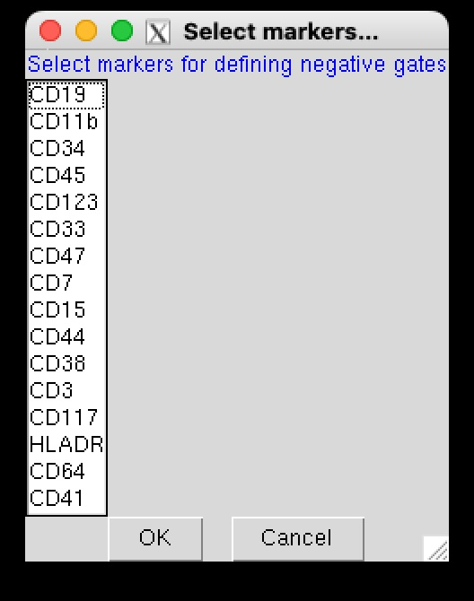
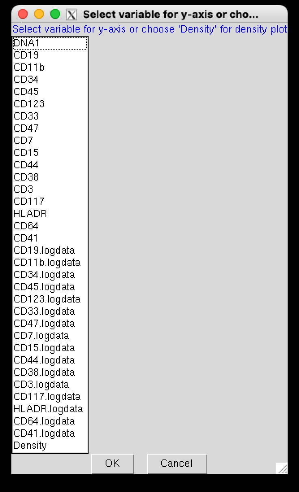
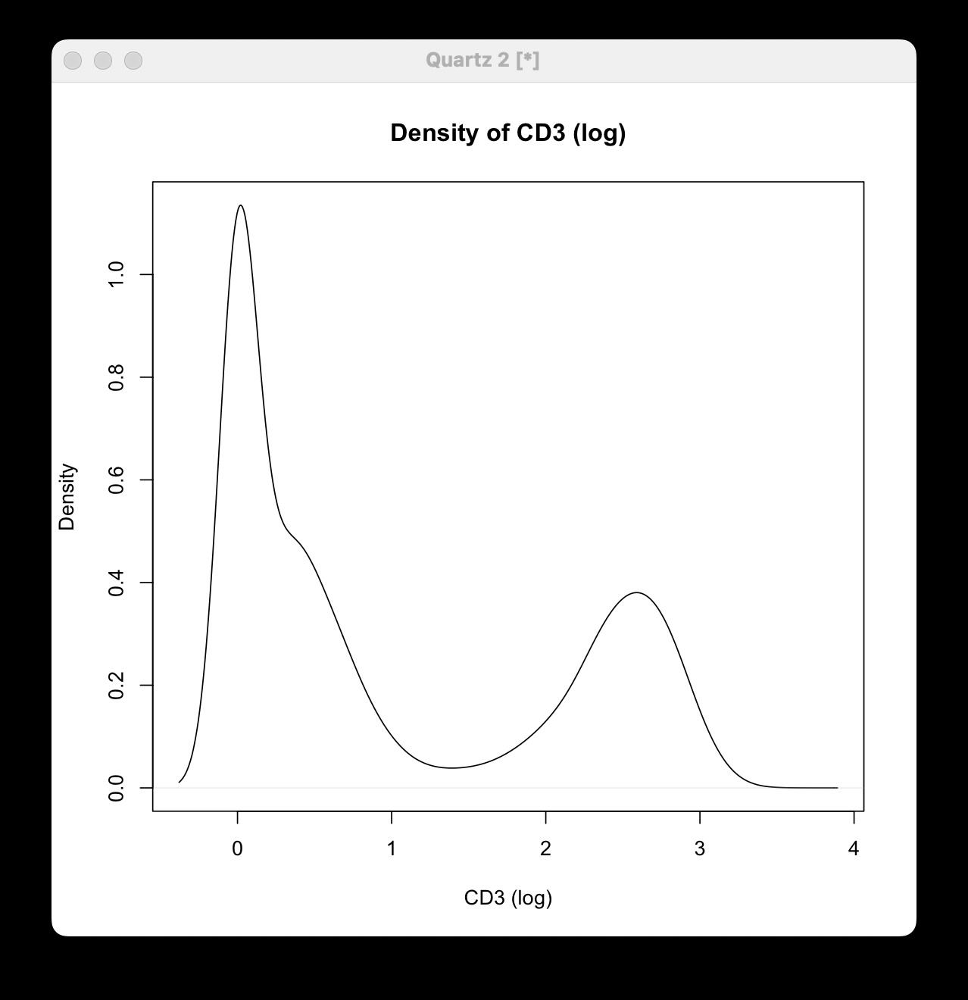
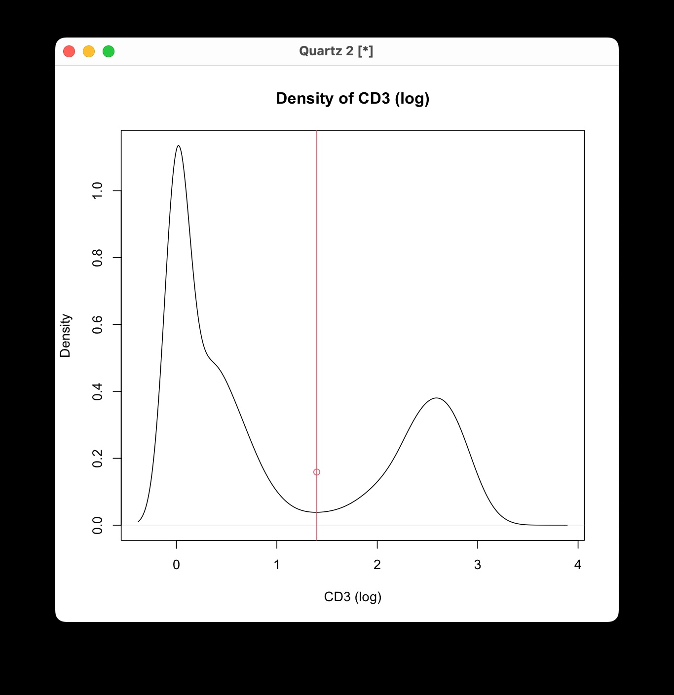
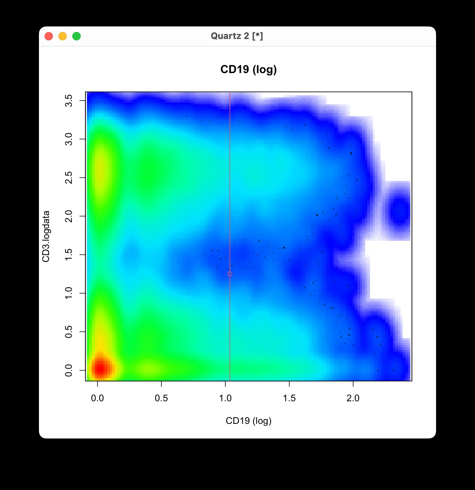

```{r, out.width = "40%", echo = FALSE}
knitr::include_graphics('assets/GatingTree_logo.jpg')
```

## Defining Thresholds for Marker Positivity Using Interactive Sessions

This vignette demonstrates how to use the `DefineNegatives` function, which enables interactive definition of thresholds for marker positivity/negativity (or autofluorescence).

To interactively define autofluorescence without negative controls, run:

```{r, eval = FALSE}
# Interactively define marker positivity/ autofluorescence
x <- DefineNegatives(x)
```

Running `DefineNegatives` initiates an interactive session, prompting you to set thresholds for marker positivity.

### Step 1: Selecting Markers

First, select the markers for which you want to set thresholds. A prompt will appear allowing you to choose the markers from your dataset.

 
```{r, out.width = "30%", echo = FALSE}

```

### Step 2: Choosing the Y-axis Variable

Next, choose a variable for the y-axis to generate a 2D plot for setting a threshold along the x-axis (i.e., for the chosen marker). Alternatively, you can select "Density" to generate a density plot.


```{r, out.width = "40%", echo = FALSE}

```

Thank you for clarifying that distinction. It’s essential to apply the correct terminology for different markers based on their staining characteristics and data distribution. Here’s a revised version of the R Markdown content that accounts for the variability in how markers should be interpreted, using both "high vs low" and "positive vs negative" designations where appropriate:

## Using a Density Plot (Histogram)

If you select "Density," a density plot (smoothed histogram) of the marker's expression levels is displayed:

```{r, out.width = "40%", echo = FALSE}

```

- **Defining the Threshold**: Click on the plot at the point where you want to set the threshold along the x-axis. Depending on the marker characteristics:
  - For markers like CD45 and CD44, where staining is observed in most cells, set the threshold between 'high' and 'low'.
  - For other markers, determine the threshold to differentiate 'positive' from 'negative' populations, particularly when a clear autofluorescence background separation is visible. 
  The y-axis values are not considered in this selection.
- **Confirming Your Selection**: After clicking, press the Escape (ESC) key to confirm your choice.

```{r, out.width = "40%", echo = FALSE}

```

You will then see a prompt in the terminal:

```
Happy with your gating? (Yes/no/cancel)
```

- **Yes**: Accepts the threshold and moves to the next marker.
- **No**: Allows you to redo the threshold selection for the current marker.
- **Cancel**: Exits the interactive session.

## Using a 2D Plot

Alternatively, you can select a different marker for the y-axis to create a 2D scatter plot. This method can be useful depending on the data structure and characteristics of your antibodies.

```{r, out.width = "40%", echo = FALSE}

```

- **Defining the Threshold**: Click on the plot at the desired threshold point along the x-axis. Again, the y-axis values are ignored for threshold setting.
- **Confirming Your Selection**: Press the Escape (ESC) key to confirm your choice.

After confirming, you'll receive the same terminal prompt to confirm or redo your selection.

## Completing the Interactive Session

Once thresholds are set for all selected markers, the interactive session will complete automatically. Your `FlowObject` (`x`) now contains the defined thresholds, which can be used in subsequent analyses with the **GatingTree** package.

## Considerations and Best Practice:
An automated approach using staining controls was tested but found impractical due to challenges with autofluorescence and variability in negative populations. Manual interactive thresholding remains the recommended method, and future development aims to improve automation in threshold determination. Thus, currently, the recommended approach is as follows:

- **Visual Inspection:**
  - Initially use the density plot option to examine the plots for distinct peaks or inflection points.
  - Place thresholds appropriately based on marker characteristics: at the boundary between high and low expression levels for broadly stained markers, or between positive and negative populations for others.
  - If the density plot is not conclusive, use a 2D plot with a biologically meaningful marker for the y-axis.
- **Adjustments:**
  - If the initial thresholds are not satisfactory, rerun `DefineNegatives` for the specific markers and adjust accordingly.

